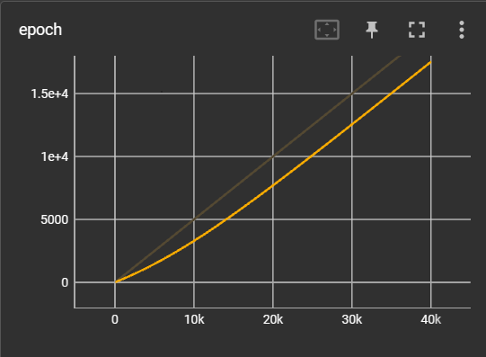
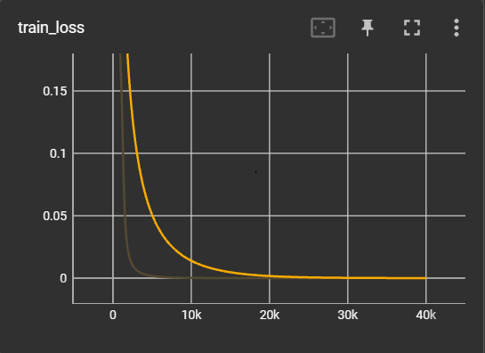

# LSTM (Long Short-term Memory) Models

- This is my models that building from scratch with PytorchLightning
- The data for training models that declared in the code
  NOTE: the Data is tiny, just for testing models purpose ( (2,4) Tensor)
- `lightning_logs` used for ternsorboard:
  `ternsorboard --logdir .\lightning_logs`

- `images` is just used to write md files nno more

# Report

Firstly, i used 3000 epochs for training. But the graph is not convergent enough. So, i decided to increase upto 5000 epochs. And again, it not enough.
Finalli, i increase a huge amount, up to 20 000 epochs. And now, it can adapt to my require.

- As you see in graphs below, i used 20 000 epochs.

- The output of Company A approximate to 0.00

.png)

- And the output of Comany B approximate to 1

.png)

- And the loss is very small

